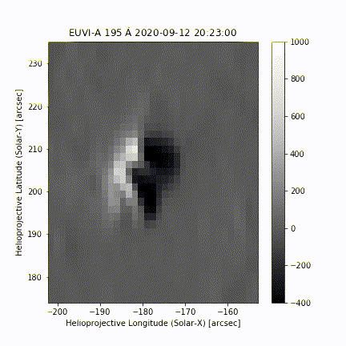
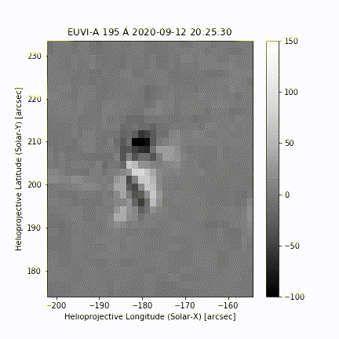

## Basic information

NuSTAR observation time (orbit 8): 2020-09-12 20:22:00 - 21:07:00

| Instrument | Wavelength regime | Cadence | Resolution |
| --- | --- | --- | --- |
| NuSTAR | SXR | 20s | low |
| XRT Be-Thin| SXR | 30s?| medium|
| AIA | EUV | 18-ish s | 0.7"|
| STEREO-A EUVI | EUV | 5 min | 1.something"|

Location determined by aligning XRT to AIA

## Figure 1: Flare Location

## Figure 2: Flare time evolution (AIA and STEREO)

|  Source | Image | Base Difference | Sobel Filter | 
| --- | --- | --- | --- |
| AIA 94 |  |   |   |
| STEREO-A 195 |  |   | <figure></figure> |

<figure>

</figure>

 

 

<figure>

</figure>

<figure>

</figure>

## Figure 2: Lightcurves

AIA at native cadence except for AIA 193 (3 minutes currently, will be updated later)

STEREO at native cadence (5 minutes).

(show boxes used for lightcurves? new figure)

 
